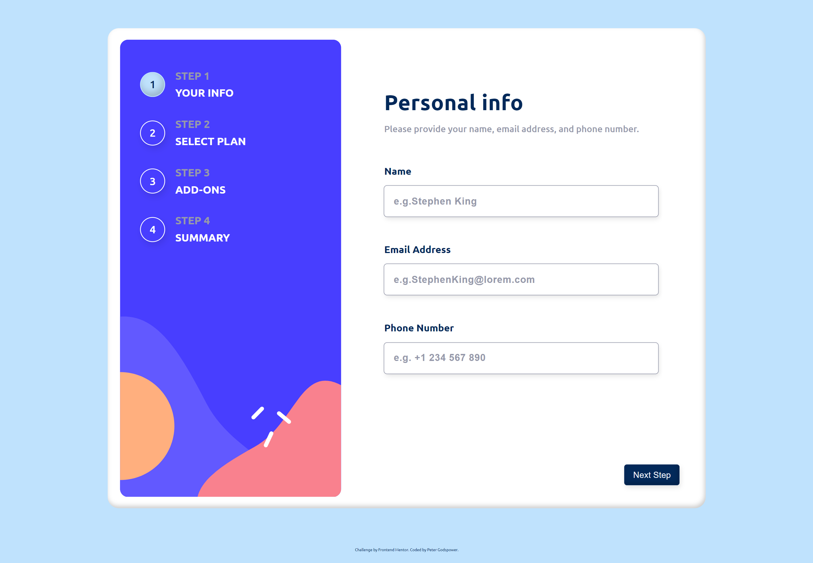
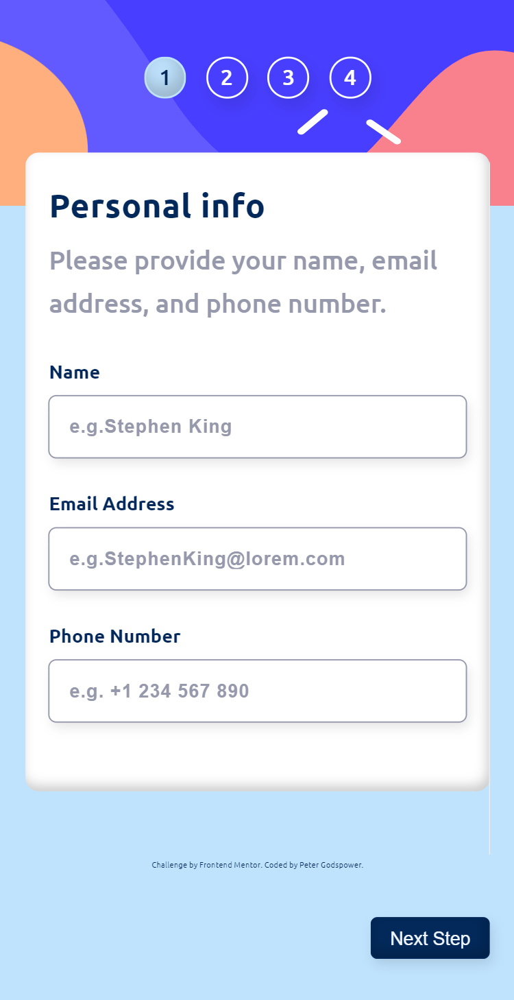

# Frontend Mentor | Multi-step Form

This repository contains my solution for the "Multi-step Form" challenge on Frontend Mentor. The project involves creating a user-friendly multi-step form that guides users through a series of inputs with validation and submission features.

## Table of Contents

- [Overview](#overview)
  - [Screenshot](#screenshot)
  - [Links](#links)
- [My Process](#my-process)
  - [Built With](#built-with)
  - [Features](#features)
  - [JavaScript Functionality](#javascript-functionality)
  - [Flow Charts](#flow-charts)
  - [What I Learned](#what-i-learned)
  - [Continued Development](#continued-development)
  - [Useful Resources](#useful-resources)
- [Author](#author)
- [Acknowledgments](#acknowledgments)

## Overview

### Screenshot

### Links

- Solution URL: [Frontend Mentor Solution](https://www.frontendmentor.io/solutions/your-solution-url)
- Live Site URL: [Live Demo](https://your-github-username.github.io/your-repo-name)

## My Process

This project focuses on building a multi-step form that enhances user experience by guiding them through each step of the data collection process. The design is clean and responsive, ensuring a seamless experience across devices.

### Built With

- **Semantic HTML5 Markup:** Utilized semantic elements for improved accessibility and SEO.
- **CSS:** Used custom properties for consistent styling, Flexbox for layout, and media queries for responsive design.
- **JavaScript:** Implemented dynamic interactions, form validation, and state management to enhance user engagement.

### Features

- **Multi-step Navigation:** Users can navigate through different steps of the form seamlessly.
- **Input Validation:** Real-time validation checks for user inputs to ensure correctness.
- **Progress Indicator:** Visual feedback on the current step in the form process.
- **Responsive Design:** The form is fully responsive, adapting to different screen sizes.
- **Submission Handling:** User inputs are collected and can be processed upon submission.

### JavaScript Functionality

The project includes multiple JavaScript files that handle core functionality. Key components include:

- **Form Management:** Handles navigation between steps and collects user inputs.
- **Validation:** Validates user inputs on each step to ensure data integrity.
- **Event Handling:** Manages user events such as button clicks and input changes.
- **State Management:** Maintains the state of user inputs across multiple steps.

### What I Learned

Through this project, I enhanced my skills in:

- **Form Management:** Understanding how to manage multi-step forms and user inputs effectively.
- **Input Validation:** Implementing robust validation checks for various input types.
- **Responsive Design:** Creating layouts that adapt seamlessly to various screen sizes using CSS Flexbox and media queries.
- **User Experience:** Designing intuitive user interactions to guide users through a process.

### Continued Development

Future updates may include:

- **Enhanced Validation:** Adding more complex validation rules and error messaging.
- **User Authentication:** Allowing users to log in and save their progress.
- **Improved Styling:** Adding animations and transitions to enhance the user experience.

### Useful Resources

- [MDN Web Docs](https://developer.mozilla.org/en-US/) - Comprehensive documentation for web technologies.
- [CSS-Tricks](https://css-tricks.com/) - Articles and tutorials on modern CSS techniques.
- [JavaScript.info](https://javascript.info/) - In-depth JavaScript tutorials and guides.
- [Frontend Mentor](https://www.frontendmentor.io/) - Platform for frontend challenges and community feedback.

## Author

- **Frontend Mentor:** [@YourUsername](https://www.frontendmentor.io/profile/@YourUsername)
- **GitHub:** [@YourUsername](https://github.com/YourUsername)

## Acknowledgments

A special thanks to Frontend Mentor for providing this challenging project and to the community for their valuable feedback and support throughout the development process.
